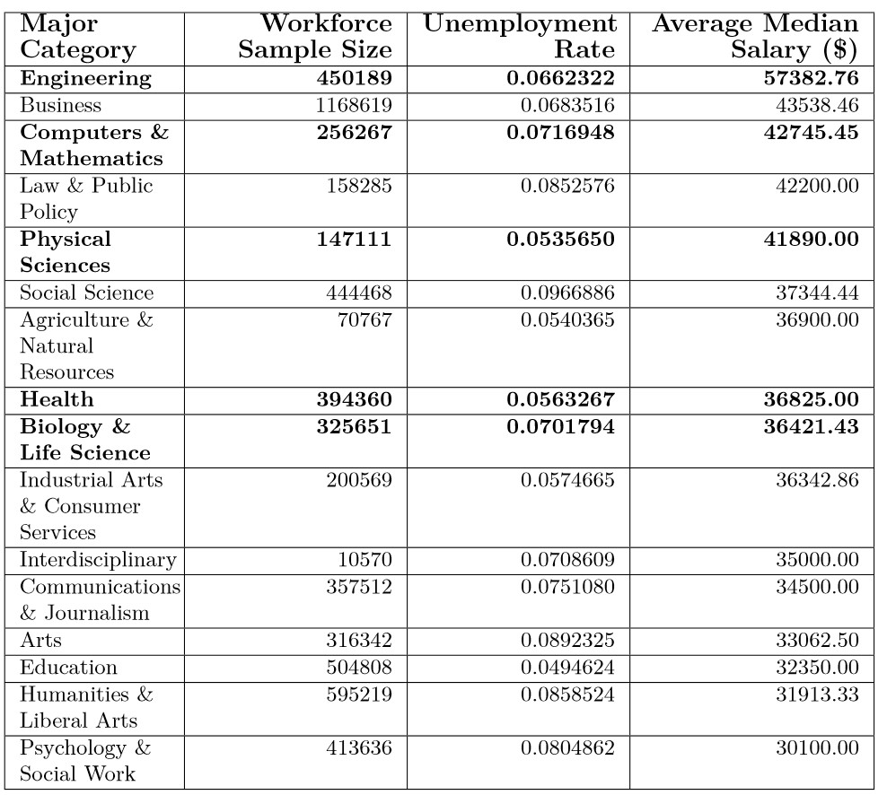

# Unemployment in STEM

Through exploratory data analysis and data visualization, our research hopes to observe whether obtaining a STEM (Science, Technology, Engineering and Mathematics) degree truly ensures that an individual will obtain a lucrative career, i.e. they are well compensated and not unemployed. From our previous research (see [Gender Wage Inequality in STEM](https://github.com/lgibson7/Gender-Wage-Inequality-in-STEM)), we know that know that not all STEM degrees secure the same level of median earnings so here we visualize levels of unemployment for the STEM major categories of  `Biology & Life Sciences` ,`Computers and Mathematics`, `Engineering`, `Health`, and `Physical Sciences` compared to all other major categories.

# Dataset Used

To address this problem, we used data sets behind the fivethirtyeight story [The Economic Guide To Picking A College Major](https://fivethirtyeight.com/features/the-economic-guide-to-picking-a-college-major/) which can be found in the following GitHub repo: https://github.com/fivethirtyeight/data/blob/master/college-majors

All data is from American Community Survey 2010-2012 Public Use Microdata Series.

Our variables are as follows:

Header | Description
---|---------
`Rank` | Rank by median earnings
`Major_code` | Major code, FO1DP in ACS PUMS
`Major` | Major description
`Major_category` | Category of major from Carnevale et al
`Total` | Total number of people with major
`Sample_size` | Sample size (unweighted) of full-time, year-round ONLY (used for earnings)
`Men` | Male graduates
`Women` | Female graduates
`ShareWomen` | Women as share of total
`Employed` | Number employed (ESR == 1 or 2)
`Full_time` | Employed 35 hours or more
`Part_time` | Employed less than 35 hours
`Full_time_year_round` | Employed at least 50 weeks (WKW == 1) and at least 35 hours (WKHP >= 35)
`Unemployed` | Number unemployed (ESR == 3)
`Unemployment_rate` | Unemployed / (Unemployed + Employed)
`Median` | Median earnings of full-time, year-round workers
`P25th` | 25th percentile of earnings
`P75th` | 75th percentile of earnings
`College_jobs` | Number with job requiring a college degree
`Non_college_jobs` | Number with job not requiring a college degree
`Low_wage_jobs` | Number in low-wage service jobs

# Tools Used

* Libraries: `dplyr`, `ggplot2`, `readr`, `forcats`
* Functions: `read_csv`, `inner_join`, `select`, `summarize`, `group_by`, `pivot_longer`, `mutate`, `ggplot`
