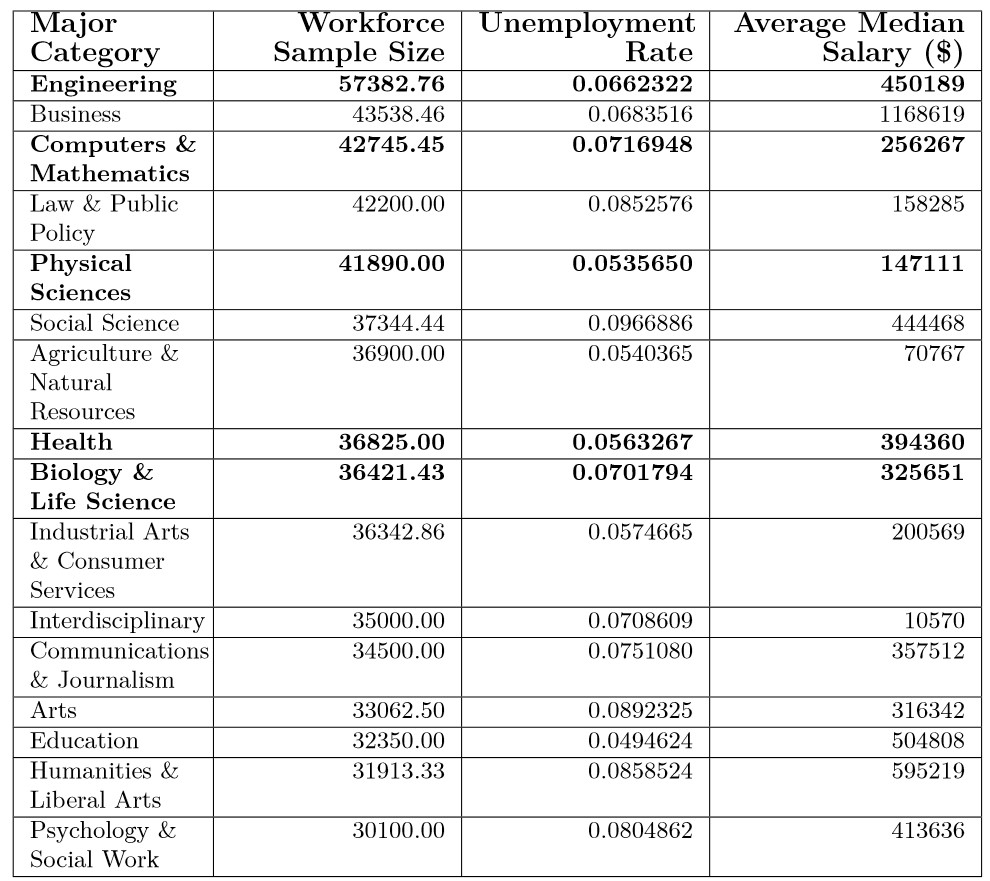

\newpage
  
## Introduction

\setlength\parindent{24pt}       Does obtaining a STEM (Science, Technology, Engineering and Mathematics) degree truly ensure that you will obtain a lucrative career? While we know that all STEM degrees do not secure the same level of earnings, surely they are at least equal in employment opportunities. Unfortunately, this is not the case as we've observed.

Although government agencies and politicians have long espoused the importance of our youth pursuing careers in STEM, the availability of these careers does not always match the market demand of our ever growing workforce. Although entry into some STEM careers is possible with a HS diploma or associates degree, often a minimum of a 4-years bachelor degree is mandatory and for others, a graduate degree such as a masters or doctoral degree is necessary for entry into specific careers.

As projected, many STEM careers which require degrees do have faster than average employment growth, but this is not true across the board for all STEM careers requiring degrees. In those instances where the growth of the workforce outpaces that of the growth of employment opportunities, we end up with highly educated individuals who are either unemployed or underemployed. 

## Data Description

\setlength\parindent{24pt}         The data was obtained from the American Community Survey 2010-2012 Public Use Microdata Series and used in the fivethirtyeight story [The Economic Guide To Picking A College Major](https://fivethirtyeight.com/features/the-economic-guide-to-picking-a-college-major/). Our data dimensions are **173 rows** by **21 columns**. Below are our variables and their descriptions.


- `Rank`: Rank by median earnings
- `Major_code`: Major code, FO1DP in ACS PUMS
- `Major`: Major description
- `Major_category`: Category of major from Carnevale et al
- `Total`: Total number of people with major
- `Sample_size`: Sample size (unweighted) of full-time, year-round ONLY (used for earnings)
- `Men`: Male graduates
- `Women`: Female graduates
- `ShareWomen`: Women as share of Total
- `Employed`: Number employed (ESR == 1 or 2)
- `Full_time`: Employed 35 hours or more
- `Part_time`: Employed less than 35 hours
- `Full_time_year_round` | Employed at least 50 weeks (WKW == 1) and at least 35 hours (WKHP >= 35)
- `Unemployed`: Number unemployed (ESR == 3)
- `Unemployment_rate`: Unemployed / (Unemployed + Employed)
- `Median`: Median earnings of full-time, year-round workers
- `P25th`: 25th percentile of earnings
- `P75th`: 75th percentile of earnings
- `College_jobs`: Number with job requiring a college degree
- `Non_college_jobs`: Number with job not requiring a college degree
- `Low_wage_jobs`: Number in low-wage service jobs

## Results
```{r include=FALSE}
library(tidyverse)
library(knitr)
library(kableExtra)
```

```{r include=FALSE}
#Getting in women in stem data
women_stem <- read_csv("women-stem.csv")
#women_stem
```


```{r include=FALSE}
#Getting in `recent_grad` data set
recent_grads <- read_csv("recent-grads.csv")
#recent_grads
```


```{r}
#Merging the two data sets by major
full_data <- women_stem %>%
  inner_join(recent_grads %>% 
               select(Major, contains("employ")), by="Major")

```


```{r}
#get a data frame with summary statistics for all major categories
dat_stats_all <- recent_grads %>%
  group_by(Major_category) %>%
  summarise(AvgMedianSalary = mean(Median),
            Workforce = sum(Unemployed) + sum(Employed),
            UnemploymentRate = sum(Unemployed) / Workforce) %>%
  mutate(Major_category = Major_category %>% as.factor() %>%
           fct_reorder(UnemploymentRate),
         STEM_Major = ifelse(!(Major_category %in% unique(women_stem$Major_category)),
                             "No" , "Yes") %>% as.factor() %>%
           fct_relevel("Yes"))
#dat_stats_all
```


In this bar plot, you see that STEM major categories `Physical Sciences`, `Health`, and `Engineering` are below the average unemployment rate of 6.82% for all major categories with rates of 5.36%, 5.6.3%, and 6.62% respectively. The other STEM majors are not too far off with unemployment rates of 7.02% and 7.17% for `Biology & Life Sciences` and `Computers & Mathematics`. For all major categories, the minimum unemployment rate was 4.95% for `Education` and the maximum was 9.67% for `Social Science`.

```{r fig.height = 8, fig.width = 10}
avg_unemploy_rate = mean(recent_grads$Unemployment_rate)
dat_stats_all %>%
  ggplot(aes(y = Major_category, 
             x = UnemploymentRate, fill = STEM_Major)) +
  geom_col() + 
  #wrap y-axis label text
  scale_y_discrete(labels = scales::label_wrap(20)) +
  # add breaks to x-axis in 0.01 intervals
    scale_x_continuous(
    breaks = c(0.0, 0.01, 0.02, 0.03, 0.04, 0.05, 0.06, 0.07, 0.08, 0.09, 0.10, 0.11)) +
  # manually change fill colors
  scale_fill_manual(values = c("#0066CC","#bebebe")) +
  # add red line representing average unemployment rate 
  geom_vline(xintercept = avg_unemploy_rate,
             color = "red", linetype = 2) + 
  labs( x = "Unemployment Rate", y = "Major Category",
       title = "Unemployment Rate by Major Category",
       fill = "STEM") + 
  # change title size
  theme(plot.title = element_text(hjust = 0.5,size = 16)) + 
  # annotate vertical line
  annotate("text",x = avg_unemploy_rate, 
         y = 1, label = paste("avg=", "","", "","", "","",round(avg_unemploy_rate,4)), color = "red", size = 4)
  
```

***Figure 1:*** Unemployment rates by major category with STEM ones highlighted in blue and the overall average unemployment rate represented by a red dotted vertical line. \newline


In this jitter plot, we visualize the summary statistics of individual majors within STEM major categories by their median salary with the bubble size correlated to the unemployment rate of each major. We again see that the physical sciences and health majors tend to have lower rates of unemployment but visually a fairly average median salary in comparison to other STEM major categories, with the exception of engineering majors which by in large have visually higher median salaries than all of the other STEM majors. As expected, we see that computer and mathematics majors on the whole have higher unemployment rates than the majors in the other STEM major categories.

```{r, warning = F, fig.height = 8, fig.width = 8}
# Get the outliers
outlier_pts <- full_data %>% filter(Median > 100000 |(Median > 60000 & Major_category == "Physical Sciences"))

full_data %>%
  ggplot(aes(x = Major_category, y = Median,
             color = Major_category,
             size = Unemployment_rate)) +
  geom_jitter(alpha = 1/5) + # set transparency of points
  # label outliers
  geom_text(data = outlier_pts, aes(label = str_wrap(Major,width = 15), size = 0.01), hjust = 0.3, vjust = 1.25, color = "Black") + 
  labs(x = "Major Category", y = "Median Salary ($ Thousands)",
       title = "Median Salary by STEM Major Category",
       size = "Unemployment Rate") +
  theme(legend.position = "top",
        plot.title = element_text(hjust = 0.5)) + 
  scale_y_continuous(breaks = c(40000, 60000, 80000, 100000),
                     labels = c("40", "60", "80", "100")) +
  guides(color = F, # remove legend for color
         size = guide_legend( # change size legend
           override.aes = list(alpha = 1#,
                               #size = c(3,4.5,5.8,7)
                               )
           )
         ) +
  # Wrap text for major categories
  scale_x_discrete(labels = scales::label_wrap(15)) +
  scale_size_binned(breaks = c(0.04, 0.06, 0.08, 0.10))

  
```
***Figure 2:*** Jitter plot of unemployment rate by STEM major category.

\newpage
\setlength\parindent{24pt}         In the table below, you see the listing of all 16 major categories, their average median salary, size of their workforce, arranged in descending order of their employment rate. We've highlighted the STEM major categories: `Biology & Life Sciences` , `Computers and Mathematics`, `Engineering`, `Health`, and `Physical Sciences`. From this table you see that not only are the STEM major categories in the top eight for Average Median Salary, they are in the bottom ten for Unemployment Rate for all major categories, made even more evident by the chart below. 
\newline
```{r}
#table for each major category with the unemployment rate and the average median salary
df1 <- dat_stats_all %>% 
 # mutate(recent_grads, Workforce = sum(Unemployed) + sum(Employed))%>%
  arrange(desc(AvgMedianSalary)) %>%
  select(c("Major_category","AvgMedianSalary","UnemploymentRate", "Workforce"))
names(df1) <- c("Major Category" , "Workforce Sample Size" , "Unemployment Rate" , "Average Median Salary ($)")

table1 <- df1 %>% 
  kable() %>% 
  # add borders everywhere
  kable_styling(bootstrap_options = "bordered",
                full_width = FALSE, font_size=9) %>%
  # Add borders left and right as well as wrap text
  column_spec(c(1), border_left = T, width = "7em") %>%
  column_spec(c(4), border_right = T, width = "10em") %>%
  # wrap text for 2nd and 3rd column
  column_spec(c(2,3), width = "9em") %>%
  # make column headers bold
  row_spec(c(0), bold = T, font_size = 11) %>%
  # make all STEM categories bold
  row_spec(which(df1$`Major Category` %in% unique(women_stem$Major_category)), bold = T)
```


***Table 1:*** Average median salary ($), unemployment rate, and total workforce sample size data by major category. \newline

\newpage
## Conclusion

\setlength\parindent{24pt}         In conclusion, we see that the association between earnings and unemployment is indeed weak as evidenced by the relatively low earnings with the major category of health care yet lower than average unemployment rate in contrast to the higher earnings in the engineering major category yet higher than average unemployment. Also, we found that those earning degrees in STEM major categories of Computers & Mathematics, Biology & Life Sciences, and Engineering had a higher than average unemployment level across all STEM and non-STEM major categories. 

Therefore, we cannot conclude that obtaining a degree in a STEM field is the magic bullet to ensuring lucrative employment. This may be due to the fact that the varying occupations requiring such degrees have differing levels of growth and employment levels. Ideally, potential workers will want to aim for fields with many job openings relative to their employment size, such as those pertaining to healthcare or computer-related careers. Other occupations (particularly, certain engineering or mathematics positions) may have small employment levels with lower than average expected growth.

Overall, many STEM careers do enjoy median income above the national average so they are still worth striving for compared to other non-STEM careers with high unemployment and lower median salary.

\newpage

## Bibliography

Casselman, B. (2014). The Economic Guide to Picking a College Major. FiveThirtyEight. Retrieved September 30, 2022, from https://fivethirtyeight.com/features/the-economic-guide-to-picking-a-college-major/. 

Terrel, N. (2007). Stem occupations: High-tech jobs for a high-tech economy. Occupational Outlook Quarterly. Retrieved September 30, 2022, from https://www.bls.gov/careeroutlook/2007/spring/art04.pdf 

Vilorio, D. (2014). Stem 101: Intro to Tomorrow's Jobs - Bureau of Labor Statistics. Occupational Outlook Quarterly. Retrieved September 30, 2022, from https://www.bls.gov/careeroutlook/2014/spring/art01.pdf 

## Code Appendix

For supplementary R script, visit <https://github.com/lgibson7/Unemployment-in-STEM>
